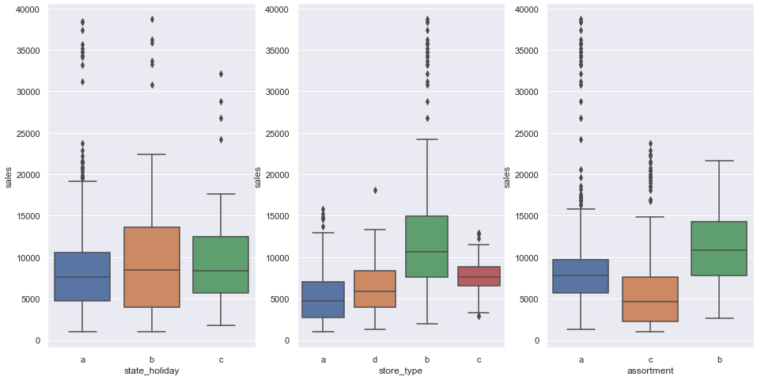
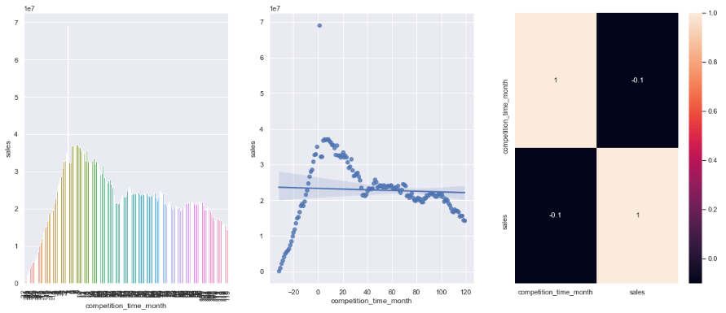

# Data Science in Production
This Repository contains the scripts and files related to the course Data Science in Production ("Data Science em Produção") from [Meigarom Lopes](https://github.com/Meigarom), who is a well-known Data Scientist with several years of experience and practical applied know-how.

---

## Table of Contents
- [Introduction](#introduction)
- [Version 02 Improvements](#version-02-improvements)
- [Module 01. The Business Problem](#module-01-the-business-problem)
- [Module 02. Data Description](#module-02-data-description)
- [Module 03. Feature Engineering](#module-03-feature-engineering)
- [Module 04. Exploratory Data Analysis (EDA)](#module-04-exploratory-data-analysis-eda)
- [Module 05. Data Preparation](#module-05-data-preparation)

---

## Introduction
The Data Science in Production course is an online course that teaches how to design and implement a data science, machine learning project with Python, from the dataset until the model deployment. The course covers also the creation of a Telegram bot, as well as the creation of a Cloud-based API and Story-Telling techniques.

Unlike other online courses, this one is particularly special because it has a business-driven approach to solve a real business problem, so that the student can really think and understand the underlying logic behind the problem request, hence one can develop a sophisticated solution that meets the business-team expectation and bring value to it.

For more details, please visit the [Data Science in Production website.](https://sejaumdatascientist.com/como-ser-um-data-scientist/)

The detailed description, step-by-step solution is described below.
Please feel free to leave a comment with improvement suggestions: it will be highly appreciated!

---

## Version 02 Improvements
The process described below refers to the version 02 of the CRISP cycle with improvements regarding to the first version. The main improvement is the use of forecasted customers’ number in the sales prediction. For that, it was made a new, specific project so that the customers’ number for the next 6 weeks could be predicted and then applied to the version 02 of the sales prediction model. This script is also available in this repository.

Furthermore, other improvements were made such as outliers’ removal and additional feature scaling regarding the first version. All of this is described below in details.

The improvements were made mainly due to the points below:
- Practice and reinforce the course learned content – python code and the CRISP Cycle;
- Improve the model predictions and results;
- Better understand the business and get new insights;
- To serve as a Coursework Completion.

---

## Module 01. The Business Problem
### 1. The Problem: the business team requested a 6-weeks sales forecast.

**Key points to understand a data science problem:**
- What is the motivation? What is the context behind?
- What is the root cause? Why does the business team need a forecast?
- Who is the Stakeholder?
- What is the expected solution format?

In this case, the key point of the problem are:
- **Request:** the CFO requested this solution to the business team in a management meeting;
- **The root cause:** the CFO aims to reform the stores. However, it is extremely hard to determine the reform budget for each store;
- **The Stakeholder:** The CFO is the Stakeholder;
- **Solution Format:**
    - **Granularity:** Daily sales forecast (in R$) per store for the next 6 weeks;
    - **Problem Type:** Sales forecast;
    - **Potential Methods:** Time Series, Regression, Neural Networks;
    - **Output Shape:** Sales forecast displayed in a smartphone.

The above-mentioned key points show that there is relevant content behind the 6 weeks sales forecast request: the final goal is to reform the stores. However, it is not possible to set a budget for that without knowing the revenue for the period: it is a risk, for example, if the reform budget exceeds the total amount of sales, that is, pratical there would not be enough money to finish the reform.

### 2. The Data
The Dataset applied to develop the solution is the [Rossmann Store Sales from Kaggle.](https://www.kaggle.com/c/rossmann-store-sales/data)

Note: the test dataset applied on version 02 was generated on the customers' prediction project and it's available in this repository.

### 3. Solution approach: The CRISP-DS Cycle
To design, model and deploy the solution will be applied the CRISP-DS (Cross-Industry Standard Process - Data Science, a.k.a. CRISP-DM) project management method.
The CRISP is a cyclic, iterative development method that covers all the steps needed to solve a data science problem. The image below shows the CRISP cycle:

[back to top](#table-of-contents)

---

## Module 02. Data Description
Data description goal is to describe and understand the available dataset that will be used to train and validate the model. In other words: **one must know the data at hand** and then notice: how challenging is the problem?

There are several ways to make a first, general data analysis. In this case, the following steps will be taken:
- Data Dimensions;
- Data Types;
- Missing values (check and fillout);
- Descriptive Statistics.

The descriptive Statistics is particularly important for two main reasons:
1. Gain business know-how;
2. Check Failures.

Within the Descriptive Statistics there are two main metrics:
- Dispersion metrics (standard deviation, min, max, skew, kurtosis);
- Central Tendency metrics (for example mean and median).

**Data Dimension:**

- Number of Rows: 1017209

- Number of Cols: 18

**Date Range:**

- first     2013-01-01

- last      2015-07-31

**Summary Statistics:**
- Numerical attributes summary table:

  
  
- Categorical Attributes Boxplot:

[back to top](#table-of-contents)

---

## Module 03. Feature Engineering
### 1. Mind Map Hypothesis
The Mind Map is created in order to understand and highlight the key points below:
1.	Phenomenon: What phenomenon is being modeled?
2.	What are the factors that influence the phenomenon?
3.	What are the factors’ attributes?
4.	Hypothesis List: Hypothesis to validate with the data.

The main goal of the mind map is to generate a hypothesis list, which will later derivate an Analysis to validate or reject them. As a result, this analysis will be the basis for business insights, which can be both new, unknown information obtained from the data analysis, as well as to oppose some biased belief.

The Mind Map below shows the key factors of daily store sales.

### 2. Hypothesis List
Based on the Mind Map, the Hypothesis List below was generated. It is important though to highlight that the hypothesis are not a cause-effect relation, but a correlation. For example, a big store should always sell more it is not always the truth in practice. The goal is to recognize and understand the tiny, little effects that contribute to increase or decrease the sales. Furthermore, for the final hypothesis list it is also taken into account the availability of information in the dataset, once the hypothesis will be later checked in the exploratory data analysis step.

### 3. Feature Engineering
The goal of the feature engineering is to derivate new features from the available ones, so that it can be used to train a predictive model. The reasons for that are:
1.	The model to be developed is as good as the data trained on it;
2.	Improve the model predictive power;
3.	It creates the possibility to use less complex models that are faster than the more complex ones;
4.	The new features can better represent the underlying problem, which will facilitate the machine learning process.

In this problem, the following steps were carried-out to perform feature engineering:
1.	Decomposing dates to year, month, day, week of year and year week – helps the model to better represent structures or seasonality;
2.	Combining  detached features such as competition open since year and competition open since month, once they are related to the same date information;
3.	Calculate date difference between the observation date and the event date, for example promo since and date to result in a new feature that shows how much time such store is in a promotion state.
4.	Replace letter by text in categorical features.

### 4. Special Feature: Customers
The customers feature deserves a specific explanation. In the first version of the CRISP cycle, that is, in the first developed model, this feature was removed in the variables filtering step (next step described below) due to a business restriction. It is so because in the 6-week sales prediction the customers’ information will not be available. In other words: it is unknown how much customers will visit the stores in the next 6 weeks. Although the customers feature is available in the training dataset, it cannot be used to train the model because it is not available in the test dataset. Hence, this feature must be removed from the training dataset.

To solve such problem and also to improve the model’s performance, in the version 02 of the CRISP cycle it was made a specific script and model (code available in this repository) to predict the number of customers for the next 6 weeks. This information was then added to the test dataset in order to allow the model to predict the sales with this information. That is only possible if the model is trained also with the customers’ feature, which is the reason it was kept in the variables filtering step in the version 02 of the CRISP Cycle.
To summarize: it can be affirmed that this version 02 is a sales prediction based on customers prediction.

### 5. Variables Filtering
The variable filtering is applied due to business restrictions. It is necessary to check, based on the data description step previously performed, if all data and features from the training dataset will be actually available in the test dataset. It is also very important to check, considering a business perspective, what are the business-team’s processes and what kind of restrictions they have to provide the data, otherwise the model will be trained with data that does not correspond to the test data, which will lead to predictions that do not accomplish the expected results.

For this problem the closed stores and stores with sales equal to zero were filtered, because they are not relevant for the sales prediction. Furthermore, the 0,1%of  highest sales values were filtered because they are outliers. Additionally, the column open was removed because only open stores are now taken into account. The column promo interval was also removed, because new features were generated from it in the previous step, therefore its information is already in the dataset.

After all of these steps the final features are described below:

[back to top](#table-of-contents)

---

## Module 04. Exploratory Data Analysis (EDA)
The exploratory data analysis is one of the main steps of the CRISP cycle. It is aimed to measure the variables impact to the response variable (target), gain business know-how, validate business hypothesis (insights) and recognize the variables that are important to the model. Also, through the exploratory data analysis both the phenomenon and the model’s prediction can be clearly explained and visualized. It is mainly with the EDA that the whole project can be presented and explained through storytelling.

The EDA consists in 3 main steps:
1.	Univariate Analysis: how is the variable behavior?
2.	Bivariate Analysis: how the variable impacts in the response variable?
3.	Multivariate Analysis: how the variables correlate with each other?

### 1.0. Univariate Analysis
The univariate analysis explores the variable itself, so that can be checked the variable frequency, distribution, range. Etc.

Below are the variables distribution graphics:

#### 1.1. Sales Distribution (response variable)

The sales have an exponential distribution with positive skew. That’s key information that will be used on the data preparation step (step 5). Also, the right tail of the graphic shows sales up to 25,000. That would be higher if in the previous step (variables filtering) the outliers (0,1%) were not removed.

#### 1.2. Numerical Variables Distribution

**Highlights:**
-	Competition distance: close competition stores (distance less than 25km) represents almost all of the observations;
-	Competition open since year: there are competitors open since the 1900’s year, but it is predominant competitors since the 2000’s year.
-	Customers has an exponential distribution, very similar to the sales one;
-	6 days have considerably more frequency than the 25 others;
-	Day of week 7 (Sunday) has a very low frequency compared to the other days. That’s because the stores seldom open on Sundays in Germany (home of Rossmann).
-	Month frequency from August to December are lower than the other months. That’s because the dataset contains registers from 2013 to July 2015.
-	Promo since year higher frequencies on 2013 and 2014.

#### 1.3. Categorical Variables Distribution

**Highlights:**
-	Holidays: the public holiday frequency is considerably higher than the other ones;
-	Store type “a” and “d” are the most frequent in the dataset;
-	Store assortment “extra” frequency is remarkably lower than the basic and extended ones.

### 2.0. Bivariate Analysis
The bivariate analysis consists of the independent variable analysis with respect to the dependent variable (target). It can be divided into two perspectives:
1.	Hypothesis validation or rejection - is it possible to generate an insight?
2.	Is the independent variable relevant for the model?

The following analysis and graphs were made based on the hypothesis list previously issued.

#### 2.1. Hypothesis H1: Stores with bigger assortment should sell more.

As the available data do not precisely describe the big assortment, it was assumed that the extra assortment was the big one. The graphics show that the extra assortment sells less than the others. Furthermore, the basic assortment sells more than the extended one, therefore it is claimed that the hypothesis H1 is false: stores with bigger assortment sell less.

#### 2.2. Hypothesis H2: Stores with competition closer should sell less.

The bar graphic shows that most of the stores that have competitors up to 1000m of distance sell more than the others. This happens because most of the stores have competitors close, as already shown in the univariate analysis. It is likely that such stores are placed in the big city centers, which have lots of stores near each other. Hence, the hypothesis is false: stores with competition close sell more. In addition, the heatmap (pearson method) shows a correlation of -0.23 between both variables.

#### 2.3. Hypothesis H3: Stores with longer time competition should sell more.

The scatter plot with the regression line clearly shows that the longer the time, the less sales amount. Another point that stands out is the negative values in the time month axis: that means that the competition will open a new store soon in the future. The bar plot shows that competition time month values near to zero represents more sales than bigger competition time month. Hence, the hypothesis is false: stores with longer time competition sell less. The heatmap shows a correlation of -0.1 between both variables.

#### 2.4. Hypothesis H4: Stores with longer sale (promo) should sell more.

The graphics were detached in two due to the two periods of promo: the standard promo and the extended promo (promo2). The promo time week higher than zero means the sale at that date was done in the promo 2 period (extended), while the promo time week lower than zero means the sale at that date was done in the standard promo period. The standard promo scatter plot with regression line shows constant sales growth. On the other hand, the extended promo (promo 2) scatter plot shows sales decrease throughout time. Therefore, the hypothesis is false: stores with longer sale (promo) sell less after some period. Also, the heatmap shows a correlation of -0.029 between promo time week and sales.

#### 2.5. Hypothesis H5: Stores with more sale (promo) days should sell more.

The bar plot shows that stores with promo sell more than stores without promo. The insight for this point comes actually from the customers EDA, which shows that stores with promo have fewer customers than stores without promo (bar plot below). This means that even though the stores have fewer customers, they buy more on promo time.

Hence, the hypothesis is true: stores with more sale (promo) days sell more.
In addition, the heatmap shows a correlation of 0.37 between promo variable and sales.

#### 2.6. Hypothesis H6: Stores with more consecutive sale (promo) should sell more.

The analysis above was made considering two conditions: stores with both traditional (promo) and extended (promo2) sales and stores with only traditional sales. The graphic clearly shows that both conditions have the same line pattern, with exception of the period from calendar week 26 of 2014 until approximately the last weeks of 2014, where traditional sales outperform the combined traditional and extended. Hence, the hypothesis is false: stores with more consecutive sale sell less.

#### 2.7. Hypothesis H7: Stores open on Christmas time should sell more.

The bar plot shows that Christmas holiday represents the worst sales values compared to the other holidays. Even though the Christmas data of 2015 is not available in the dataset, the bar plot divided by year shows that in 2013 and 2014 it was the worst holiday in terms of sales compared to the other holidays. Therefore, the hypothesis is false: stores open on Christmas sell less.

#### 2.8. Hypothesis H8: Stores should sell more throughout the years.

Both bar and regression plot show that the sales are decreasing throughout the years. However, it is important to point out that the dataset contains observations of 2015 only until July, therefore it has a fewer sales amount. Also, it is not possible to assume whether the sales of 2015 will be better or worse than 2013 and 2014. To do so, one should make a project only to predict the sales until the end of 2015. 
A more detailed analysis is shown in the next hypothesis data exploration. Nevertheless, based on the available data, the hypothesis is false: stores sell less throughout the years. Furthermore, the heatmap shows a strong correlation of -0.92 between year and sales.

#### 2.9. Hypothesis H9: Stores should sell more on second semester.

The bar plot and the scatter plot with regression line show that the sales decrease throughout the months. That is mainly because the data of 2015 have observations only from January until July. Therefore, the graphics below were generated to compare monthly sales performance by year.

The bar plot of 2013 shows sales increase in the second semester. On the other hand, the bar plot of 2014 shows the opposite: the sales decreased in the second semester. Unfortunately, there is no available data for the whole year of 2015, therefore it is not possible to confirm whether the second semester of this year sold more than the previous one.

Below are the bar plots divided by the first and second semester of each year. The first semester of 2015 outperformed the first and second semester of 2014, but it is not possible to assume that the second semester of 2015 will perform better or worse than that. As previously mentioned, for a conclusive statement it is necessary to develop a new project to predict the sales until the end of 2015.

Based on the available data and the analysis described above, it is assumed that the hypothesis is false: stores sell less on second semester.

In addition, the heatmap shows a strong correlation of -0.76 between month variable and sales.

#### 2.10. Hypothesis H10: Stores should sell more after the 10th day of the month.

The scatter plot with regression line shows a tendency of sales decrease as the day of the month increases. The first bar plot shows the amount of sales by each day of the month, however it is not conclusive. Hence, the second bar plot was generated grouping each 10 days, which resulted in three main blocks: before 10 days, between day 11 and 20 and between day 21 and day 31. The first block is slightly higher than the others. The table below shows the exact sales values, in order to confirm which period represents more sales.

The sales before 10 days are higher than the other periods. Hence, the hypothesis is false: stores sell less after the 10th day of the month.

One point to highlight is the EDA from the customers’ prediction project regarding the amount of customers after the 10th day of the month: the number of customers’ increases after the 10th day, as shown in the bar plot and table below. That is the opposite of the sales amount as shown above. Therefore, it can be assumed that, although the number of customers increases throughout the month, the sales don’t necessarily follow the same pattern. In other words: the customers spend less money after the 10th day of the month.

Furthermore, the heatmap shows a correlation of -0.35 between day variable and sales.

#### 2.11. Hypothesis H11: Stores should sell less on weekend.

According to the ISO Week Day Standard, Monday is represented by number 1 and Sunday by number 7. This is the standard applied on this dataset. The bar plot clearly shows that day 7 (Sunday) have significantly fewer sales. That is because the stores seldom open on Sundays in Germany (home of Rossmann), as Sunday is the rest day for the Germans. Hence, the hypothesis is true: stores sell less on weekend. Furthermore, the heatmap shows a correlation of -0.76 between day of week and sales.

#### 2.12. Hypothesis H12: Stores should sell less while school vacation.

The first bar plot clearly shows that the sales are higher without school holiday. The second bar plot shows the school holiday per month. Only in August the sales on school holidays outperformed the sales without school holiday. Therefore, the hypothesis is true: stores sell less during school vacation.

#### 2.13. Hypothesis H13: Stores with more customers should sell more.

This hypothesis was added in the second CRISP cycle, as the customers prediction was generated in the customers prediction project. The scatter plot with regression line shows the relation between customers and sales: the more the customers, the more the sales. Furthermore, the heatmap also shows a strong correlation of 0.82 between them. Hence, the hypothesis is true: stores with more customers sell more.

The table below summarizes the data exploration and hypothesis analysis and validation:

### 3.0. Multivariate Analysis
The main goal of the multivariate analysis is to check how variables are related. This is important because it can show the variables with strong or weak relation. The weak ones can later be removed in order to reduce the dataset dimensionality, hence reduce model’s complexity.

#### 3.1. Numerical Variables
For the numerical variables it is applied the Pearson correlation method (a.k.a. Product Moment Correlation Coefficient – PMCC). The Pearson’s correlation coefficient measures the statistical relationship between two continuous variables. This method is widely applied because it is based on the method of covariance ([Reference](https://www.statisticssolutions.com/pearsons-correlation-coefficient/)). With Pearson coefficient can be stated that the variables are correlated, but it cannot be concluded that the variables have a causal relation. It is also important to highlight that a correlation equal to zero does NOT imply that the variables are independent. BUT independency between the variables implies in correlation equal to zero.

The heatmap below shows the correlation of each variable according Pearson method.

#### 3.2. Categorical Variables
For the categorical variables it is applied the Cramer-V correlation method. A specific function was created in the code in order to calculate the correlation based on its formula, which includes among others a confusion matrix and the chi-squared ([Reference](https://en.wikipedia.org/wiki/Cram%C3%A9r%27s_V)).

The heatmap below shows the categorical variables correlation according the Cramer-V method.

[back to top](#table-of-contents)

---

## Module 05. Data Preparation

Most of the Data Science problems, and this one is also included, have many different sorts of values in the dataset, which represents different range of values. For example, the variable month have a range from 1 to 12, while the competition distance variable has values up to 200000. That can difficult the machine learning training. Furthermore, the categorical variables are in most of the cases with text information, which the machine learning algorithm cannot interpret. To solve this is issue, the data must be prepared (a.k.a. preprocessed) so that the machine learning model can properly train and deliver high performance results.

There are mainly three types of data preparation:
- **Normalization:** Rescale the center (mean) to zero with standard deviation of 1, usually applied for variables with a normal, Gaussian distribution;
- **Rescaling:** Rescale the numerical variable to a range between 0 and 1, normally applied for variables without a Gaussian distribution;
- **Transformation:**
    - Conversion of categorical variables to numerical (Encoding);
    - Nature transformation for variables with cyclic nature (for example months of the year);
    - Logarithm transformation.

### 5.1. Rescaling
All numerical variables without a cyclic attribute will be rescaled. As verified on the exploratory data analysis, none of them have a Normal (Gaussian) distribution. Therefore, the normalization will not be applied.

Two rescaling techniques will be applied: the Min-Max Scaler and the Robust Scaler.

The Min-Max Scaler is applied in non-Gaussian distributions. However, it is susceptible to outliers, that is, if the feature has a high outlier influence, than the Min-Max Scaler will tend to result in distorted numbers due to the outliers. That happens because it uses the maximal and minimal values (range) to rescale the numbers.

The Robust Scaler is also applied to non-Gaussian distributions, and performs better for variables with outliers, because it scales the data with the range of the first quartile (25th quantile) and the third quartile (75th quantile) of the IQR (Interquartile Range).

Hence, to decide which scaler to apply it is necessary to check the outliers influence in each numerical variable. To do so, it was verified the box plot and the stats summary of the variables.

One important note to add is that the box plot shows clearly the outliers of a variable. The “maximum” and “minimum” values shown in the box plot are actually calculated as shown below:

Therefore, every observation that is below or above the minimum and maximum of the boxplot are considered outliers. If the variable has lots of points in this area, that means it has a high outliers influence, than the Robust Scaler must be applied. On the other hand, if the variable have few points in this area, means that it has a low outliers influence, hence the Min Max Scaler can be applied.

Below are the box plots and stats summary of the numerical variables of this project.

After the analysis, the scalers were applied as follows:
- **Robust Scaler (high outliers influence):** competition_distance, competition_time_month, competition_open_since_year and customers
- **Min-Max Scaler (low outliers influence):** competition_time_month, promo_time_week, year, promo2_since_year

### 5.2. Transformation

#### 5.2.1. Encoding
Encoding transformation is applied for categorical variables that contain label values rather than numeric values. There are several encoding techniques, and it is not the scope of this project to describe each one of them. The encoding techniques applied in this project are:
- One-Hot Encoding;
- Label Encoding;
- Ordinal Encoding.

The One-Hot Encoding assigns for each label of the categorical variable a binary value, also known as “dummy variable”.  This encoding is very simple and easy to apply, however it increases the number of columns in the dataset, which means a higher dimensionality and therefore can negatively affect the machine learning model training. This encoding fits good for variables that has a “state” condition, for example for holidays: ordinary days have a state, while a holiday has another state. Hence, the one-hot encoding was applied for the state holiday variable.

The Label Encoding assigns a number for each label of the categorical variable. It has a positive usage for variables with name, for example. Therefore, it was applied for the variable store type.

The Ordinal Encoding, as the label encoding, also assigns a number for each label. The difference, however, is that it follows the order of magnitude of each label. For example: temperature labels like hot, cold and very hot would have the following sequence and values: very hot 3 > hot 2 > cold 1. Hence, the ordinal encoding was applied for the assortment variable.

#### 5.2.2. Nature Transformation
Nature transformation is applied for features cyclical in nature. These are features mainly related to time: months, days, weekdays, hours, etc. The machine learning algorithm must somehow know that such features have this characteristic, therefore such transformation is needed. The cyclical encoding method applied in this project was the data transformation into two dimensions using a sine and cosine transformation. It was applied for the cyclic variables: day_of_week, day, month, week_of_year, competition_open_since_month and  promo2_since_week.

#### 5.2.3. Logarithm Transformation
The logarithm transformation (or log transformation) is applied for variables with an exponential distribution, so that after the transformation it has a Gaussian distribution. The advantages are: faster computation, lower order of magnitude, clearer relationships and homogeneous variance. In addition, the machine learning algorithm predicts better with the dependent variable (target) on a (or approximately) normal distribution.

The log transformation was applied in the response variable (sales), as it has an exponential distribution. The images below show the sales distribution before and after the log transformation.

[back to top](#table-of-contents)

---