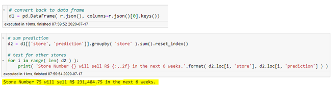
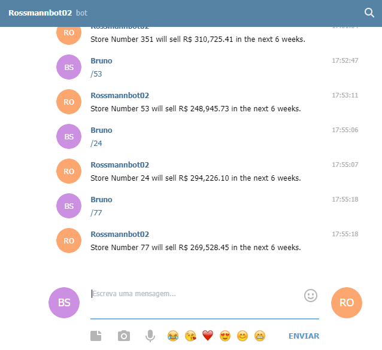

# Data Science in Production
This Repository contains the scripts and files related to the course Data Science in Production ("Data Science em Produção") from [Meigarom Lopes](https://github.com/Meigarom), who is a well-known Data Scientist with several years of experience and practical applied know-how.

---

## Table of Contents
- [Introduction](#introduction)
- [Version 02 Improvements](#version-02-improvements)
- [Module 01. The Business Problem](#module-01-the-business-problem)
- [Module 02. Data Description](#module-02-data-description)
- [Module 03. Feature Engineering](#module-03-feature-engineering)
- [Module 04. Exploratory Data Analysis (EDA)](#module-04-exploratory-data-analysis-eda)
- [Module 05. Data Preparation](#module-05-data-preparation)
- [Module 06. Feature Selection](#module-06-feature-selection)
- [Module 07. Machine Learning Modelling](#module-07-machine-learning-modelling)
- [Module 08. Hyperparameter Fine Tuning](#module-08-hyperparameter-fine-tuning)
- [Module 09. Error Translation and Interpretation](#module-09-error-translation-and-interpretation)
- [Module 10. Deploy Model to Production](#module-10-deploy-model-to-production)
- [Module 11. The Rossmann Telegram Bot](#module-11-the-rossmann-telegram-bot)
- [Conclusion](#conclusion)

---

## Introduction
The Data Science in Production course is an online course that teaches how to design and implement a data science, machine learning project with Python, from the dataset until the model deployment. The course covers also the creation of a Telegram bot, as well as the creation of a Cloud-based API and Story-Telling techniques.

Unlike other online courses, this one is particularly special because it has a business-driven approach to solve a real business problem, so that the student can really think and understand the underlying logic behind the problem request, hence one can develop a sophisticated solution that meets the business-team expectation and bring value to it.

For more details, please visit the [Data Science in Production website.](https://sejaumdatascientist.com/como-ser-um-data-scientist/)

The detailed description, step-by-step solution is described below.
Please feel free to leave a comment with improvement suggestions: it will be highly appreciated!

---

## Version 02 Improvements
The process described below refers to the version 02 of the CRISP cycle with improvements regarding to the first version. The main improvement is the use of forecasted customers’ number in the sales prediction. For that, it was made a new, specific project so that the customers’ number for the next 6 weeks could be predicted and then applied to the version 02 of the sales prediction model. This script is also available in this repository.

Furthermore, other improvements were made such as outliers’ removal and additional feature scaling regarding the first version. All of this is described below in details.

The improvements were made mainly due to the points below:
- Practice and reinforce the course learned content – python code and the CRISP Cycle;
- Improve the model predictions and results;
- Better understand the business and get new insights;
- To serve as a Coursework Completion.

---

## Module 01. The Business Problem
### 1. The Problem: the business team requested a 6-weeks sales forecast.

**Key points to understand a data science problem:**
- What is the motivation? What is the context behind?
- What is the root cause? Why does the business team need a forecast?
- Who is the Stakeholder?
- What is the expected solution format?

In this case, the key point of the problem are:
- **Request:** the CFO requested this solution to the business team in a management meeting;
- **The root cause:** the CFO aims to reform the stores. However, it is extremely hard to determine the reform budget for each store;
- **The Stakeholder:** The CFO is the Stakeholder;
- **Solution Format:**
    - **Granularity:** Daily sales forecast (in R$) per store for the next 6 weeks;
    - **Problem Type:** Sales forecast;
    - **Potential Methods:** Time Series, Regression, Neural Networks;
    - **Output Shape:** Sales forecast displayed in a smartphone.

The above-mentioned key points show that there is relevant content behind the 6 weeks sales forecast request: the final goal is to reform the stores. However, it is not possible to set a budget for that without knowing the revenue for the period: it is a risk, for example, if the reform budget exceeds the total amount of sales, that is, pratical there would not be enough money to finish the reform.

### 2. The Data
The Dataset applied to develop the solution is the [Rossmann Store Sales from Kaggle.](https://www.kaggle.com/c/rossmann-store-sales/data)

Note: the test dataset applied on version 02 was generated on the customers' prediction project and it's available in this repository.

### 3. Solution approach: The CRISP-DS Cycle
To design, model and deploy the solution will be applied the CRISP-DS (Cross-Industry Standard Process - Data Science, a.k.a. CRISP-DM) project management method.
The CRISP is a cyclic, iterative development method that covers all the steps needed to solve a data science problem. The image below shows the CRISP cycle:

[back to top](#table-of-contents)

---

## Module 02. Data Description
Data description goal is to describe and understand the available dataset that will be used to train and validate the model. In other words: **one must know the data at hand** and then notice: how challenging is the problem?

There are several ways to make a first, general data analysis. In this case, the following steps will be taken:
- Data Dimensions;
- Data Types;
- Missing values (check and fillout);
- Descriptive Statistics.

The descriptive Statistics is particularly important for two main reasons:
1. Gain business know-how;
2. Check Failures.

Within the Descriptive Statistics there are two main metrics:
- Dispersion metrics (standard deviation, min, max, skew, kurtosis);
- Central Tendency metrics (for example mean and median).

**Data Dimension:**

- Number of Rows: 1017209

- Number of Cols: 18

**Date Range:**

- first     2013-01-01

- last      2015-07-31

**Summary Statistics:**
- Numerical attributes summary table:

  
  
- Categorical Attributes Boxplot:

[back to top](#table-of-contents)

---

## Module 03. Feature Engineering
### 1. Mind Map Hypothesis
The Mind Map is created in order to understand and highlight the key points below:
1.	Phenomenon: What phenomenon is being modeled?
2.	What are the factors that influence the phenomenon?
3.	What are the factors’ attributes?
4.	Hypothesis List: Hypothesis to validate with the data.

The main goal of the mind map is to generate a hypothesis list, which will later derivate an Analysis to validate or reject them. As a result, this analysis will be the basis for business insights, which can be both new, unknown information obtained from the data analysis, as well as to oppose some biased belief.

The Mind Map below shows the key factors of daily store sales.

### 2. Hypothesis List
Based on the Mind Map, the Hypothesis List below was generated. It is important though to highlight that the hypothesis are not a cause-effect relation, but a correlation. For example, a big store should always sell more it is not always the truth in practice. The goal is to recognize and understand the tiny, little effects that contribute to increase or decrease the sales. Furthermore, for the final hypothesis list it is also taken into account the availability of information in the dataset, once the hypothesis will be later checked in the exploratory data analysis step.

### 3. Feature Engineering
The goal of the feature engineering is to derivate new features from the available ones, so that it can be used to train a predictive model. The reasons for that are:
1.	The model to be developed is as good as the data trained on it;
2.	Improve the model predictive power;
3.	It creates the possibility to use less complex models that are faster than the more complex ones;
4.	The new features can better represent the underlying problem, which will facilitate the machine learning process.

In this problem, the following steps were carried-out to perform feature engineering:
1.	Decomposing dates to year, month, day, week of year and year week – helps the model to better represent structures or seasonality;
2.	Combining  detached features such as competition open since year and competition open since month, once they are related to the same date information;
3.	Calculate date difference between the observation date and the event date, for example promo since and date to result in a new feature that shows how much time such store is in a promotion state.
4.	Replace letter by text in categorical features.

### 4. Special Feature: Customers
The customers feature deserves a specific explanation. In the first version of the CRISP cycle, that is, in the first developed model, this feature was removed in the variables filtering step (next step described below) due to a business restriction. It is so because in the 6-week sales prediction the customers’ information will not be available. In other words: it is unknown how much customers will visit the stores in the next 6 weeks. Although the customers feature is available in the training dataset, it cannot be used to train the model because it is not available in the test dataset. Hence, this feature must be removed from the training dataset.

To solve such problem and also to improve the model’s performance, in the version 02 of the CRISP cycle it was made a specific script and model (code available in this repository) to predict the number of customers for the next 6 weeks. This information was then added to the test dataset in order to allow the model to predict the sales with this information. That is only possible if the model is trained also with the customers’ feature, which is the reason it was kept in the variables filtering step in the version 02 of the CRISP Cycle.
To summarize: it can be affirmed that this version 02 is a sales prediction based on customers prediction.

### 5. Variables Filtering
The variable filtering is applied due to business restrictions. It is necessary to check, based on the data description step previously performed, if all data and features from the training dataset will be actually available in the test dataset. It is also very important to check, considering a business perspective, what are the business-team’s processes and what kind of restrictions they have to provide the data, otherwise the model will be trained with data that does not correspond to the test data, which will lead to predictions that do not accomplish the expected results.

For this problem the closed stores and stores with sales equal to zero were filtered, because they are not relevant for the sales prediction. Furthermore, the 0,1%of  highest sales values were filtered because they are outliers. Additionally, the column open was removed because only open stores are now taken into account. The column promo interval was also removed, because new features were generated from it in the previous step, therefore its information is already in the dataset.

After all of these steps the final features are described below:

[back to top](#table-of-contents)

---

## Module 04. Exploratory Data Analysis (EDA)
The exploratory data analysis is one of the main steps of the CRISP cycle. It is aimed to measure the variables impact to the response variable (target), gain business know-how, validate business hypothesis (insights) and recognize the variables that are important to the model. Also, through the exploratory data analysis both the phenomenon and the model’s prediction can be clearly explained and visualized. It is mainly with the EDA that the whole project can be presented and explained through storytelling.

The EDA consists in 3 main steps:
1.	Univariate Analysis: how is the variable behavior?
2.	Bivariate Analysis: how the variable impacts in the response variable?
3.	Multivariate Analysis: how the variables correlate with each other?

### 1.0. Univariate Analysis
The univariate analysis explores the variable itself, so that can be checked the variable frequency, distribution, range. Etc.

Below are the variables distribution graphics:

#### 1.1. Sales Distribution (response variable)

The sales have an exponential distribution with positive skew. That’s key information that will be used on the data preparation step (step 5). Also, the right tail of the graphic shows sales up to 25,000. That would be higher if in the previous step (variables filtering) the outliers (0,1%) were not removed.

#### 1.2. Numerical Variables Distribution

**Highlights:**
-	Competition distance: close competition stores (distance less than 25km) represents almost all of the observations;
-	Competition open since year: there are competitors open since the 1900’s year, but it is predominant competitors since the 2000’s year.
-	Customers has an exponential distribution, very similar to the sales one;
-	6 days have considerably more frequency than the 25 others;
-	Day of week 7 (Sunday) has a very low frequency compared to the other days. That’s because the stores seldom open on Sundays in Germany (home of Rossmann).
-	Month frequency from August to December are lower than the other months. That’s because the dataset contains registers from 2013 to July 2015.
-	Promo since year higher frequencies on 2013 and 2014.

#### 1.3. Categorical Variables Distribution

**Highlights:**
-	Holidays: the public holiday frequency is considerably higher than the other ones;
-	Store type “a” and “d” are the most frequent in the dataset;
-	Store assortment “extra” frequency is remarkably lower than the basic and extended ones.

### 2.0. Bivariate Analysis
The bivariate analysis consists of the independent variable analysis with respect to the dependent variable (target). It can be divided into two perspectives:
1.	Hypothesis validation or rejection - is it possible to generate an insight?
2.	Is the independent variable relevant for the model?

The following analysis and graphs were made based on the hypothesis list previously issued.

#### 2.1. Hypothesis H1: Stores with bigger assortment should sell more.

As the available data do not precisely describe the big assortment, it was assumed that the extra assortment was the big one. The graphics show that the extra assortment sells less than the others. Furthermore, the basic assortment sells more than the extended one, therefore it is claimed that the hypothesis H1 is false: stores with bigger assortment sell less.

#### 2.2. Hypothesis H2: Stores with competition closer should sell less.

The bar graphic shows that most of the stores that have competitors up to 1000m of distance sell more than the others. This happens because most of the stores have competitors close, as already shown in the univariate analysis. It is likely that such stores are placed in the big city centers, which have lots of stores near each other. Hence, the hypothesis is false: stores with competition close sell more. In addition, the heatmap (pearson method) shows a correlation of -0.23 between both variables.

#### 2.3. Hypothesis H3: Stores with longer time competition should sell more.

The scatter plot with the regression line clearly shows that the longer the time, the less sales amount. Another point that stands out is the negative values in the time month axis: that means that the competition will open a new store soon in the future. The bar plot shows that competition time month values near to zero represents more sales than bigger competition time month. Hence, the hypothesis is false: stores with longer time competition sell less. The heatmap shows a correlation of -0.1 between both variables.

#### 2.4. Hypothesis H4: Stores with longer sale (promo) should sell more.

The graphics were detached in two due to the two periods of promo: the standard promo and the extended promo (promo2). The promo time week higher than zero means the sale at that date was done in the promo 2 period (extended), while the promo time week lower than zero means the sale at that date was done in the standard promo period. The standard promo scatter plot with regression line shows constant sales growth. On the other hand, the extended promo (promo 2) scatter plot shows sales decrease throughout time. Therefore, the hypothesis is false: stores with longer sale (promo) sell less after some period. Also, the heatmap shows a correlation of -0.029 between promo time week and sales.

#### 2.5. Hypothesis H5: Stores with more sale (promo) days should sell more.

The bar plot shows that stores with promo sell more than stores without promo. The insight for this point comes actually from the customers EDA, which shows that stores with promo have fewer customers than stores without promo (bar plot below). This means that even though the stores have fewer customers, they buy more on promo time.

Hence, the hypothesis is true: stores with more sale (promo) days sell more.
In addition, the heatmap shows a correlation of 0.37 between promo variable and sales.

#### 2.6. Hypothesis H6: Stores with more consecutive sale (promo) should sell more.

The analysis above was made considering two conditions: stores with both traditional (promo) and extended (promo2) sales and stores with only traditional sales. The graphic clearly shows that both conditions have the same line pattern, with exception of the period from calendar week 26 of 2014 until approximately the last weeks of 2014, where traditional sales outperform the combined traditional and extended. Hence, the hypothesis is false: stores with more consecutive sale sell less.

#### 2.7. Hypothesis H7: Stores open on Christmas time should sell more.

The bar plot shows that Christmas holiday represents the worst sales values compared to the other holidays. Even though the Christmas data of 2015 is not available in the dataset, the bar plot divided by year shows that in 2013 and 2014 it was the worst holiday in terms of sales compared to the other holidays. Therefore, the hypothesis is false: stores open on Christmas sell less.

#### 2.8. Hypothesis H8: Stores should sell more throughout the years.

Both bar and regression plot show that the sales are decreasing throughout the years. However, it is important to point out that the dataset contains observations of 2015 only until July, therefore it has a fewer sales amount. Also, it is not possible to assume whether the sales of 2015 will be better or worse than 2013 and 2014. To do so, one should make a project only to predict the sales until the end of 2015. 
A more detailed analysis is shown in the next hypothesis data exploration. Nevertheless, based on the available data, the hypothesis is false: stores sell less throughout the years. Furthermore, the heatmap shows a strong correlation of -0.92 between year and sales.

#### 2.9. Hypothesis H9: Stores should sell more on second semester.

The bar plot and the scatter plot with regression line show that the sales decrease throughout the months. That is mainly because the data of 2015 have observations only from January until July. Therefore, the graphics below were generated to compare monthly sales performance by year.

The bar plot of 2013 shows sales increase in the second semester. On the other hand, the bar plot of 2014 shows the opposite: the sales decreased in the second semester. Unfortunately, there is no available data for the whole year of 2015, therefore it is not possible to confirm whether the second semester of this year sold more than the previous one.

Below are the bar plots divided by the first and second semester of each year. The first semester of 2015 outperformed the first and second semester of 2014, but it is not possible to assume that the second semester of 2015 will perform better or worse than that. As previously mentioned, for a conclusive statement it is necessary to develop a new project to predict the sales until the end of 2015.

Based on the available data and the analysis described above, it is assumed that the hypothesis is false: stores sell less on second semester.

In addition, the heatmap shows a strong correlation of -0.76 between month variable and sales.

#### 2.10. Hypothesis H10: Stores should sell more after the 10th day of the month.

The scatter plot with regression line shows a tendency of sales decrease as the day of the month increases. The first bar plot shows the amount of sales by each day of the month, however it is not conclusive. Hence, the second bar plot was generated grouping each 10 days, which resulted in three main blocks: before 10 days, between day 11 and 20 and between day 21 and day 31. The first block is slightly higher than the others. The table below shows the exact sales values, in order to confirm which period represents more sales.

The sales before 10 days are higher than the other periods. Hence, the hypothesis is false: stores sell less after the 10th day of the month.

One point to highlight is the EDA from the customers’ prediction project regarding the amount of customers after the 10th day of the month: the number of customers’ increases after the 10th day, as shown in the bar plot and table below. That is the opposite of the sales amount as shown above. Therefore, it can be assumed that, although the number of customers increases throughout the month, the sales don’t necessarily follow the same pattern. In other words: the customers spend less money after the 10th day of the month.

Furthermore, the heatmap shows a correlation of -0.35 between day variable and sales.

#### 2.11. Hypothesis H11: Stores should sell less on weekend.

According to the ISO Week Day Standard, Monday is represented by number 1 and Sunday by number 7. This is the standard applied on this dataset. The bar plot clearly shows that day 7 (Sunday) have significantly fewer sales. That is because the stores seldom open on Sundays in Germany (home of Rossmann), as Sunday is the rest day for the Germans. Hence, the hypothesis is true: stores sell less on weekend. Furthermore, the heatmap shows a correlation of -0.76 between day of week and sales.

#### 2.12. Hypothesis H12: Stores should sell less while school vacation.

The first bar plot clearly shows that the sales are higher without school holiday. The second bar plot shows the school holiday per month. Only in August the sales on school holidays outperformed the sales without school holiday. Therefore, the hypothesis is true: stores sell less during school vacation.

#### 2.13. Hypothesis H13: Stores with more customers should sell more.

This hypothesis was added in the second CRISP cycle, as the customers prediction was generated in the customers prediction project. The scatter plot with regression line shows the relation between customers and sales: the more the customers, the more the sales. Furthermore, the heatmap also shows a strong correlation of 0.82 between them. Hence, the hypothesis is true: stores with more customers sell more.

The table below summarizes the data exploration and hypothesis analysis and validation:

### 3.0. Multivariate Analysis
The main goal of the multivariate analysis is to check how variables are related. This is important because it can show the variables with strong or weak relation. The weak ones can later be removed in order to reduce the dataset dimensionality, hence reduce model’s complexity.

#### 3.1. Numerical Variables
For the numerical variables it is applied the Pearson correlation method (a.k.a. Product Moment Correlation Coefficient – PMCC). The Pearson’s correlation coefficient measures the statistical relationship between two continuous variables. This method is widely applied because it is based on the method of covariance ([Reference](https://www.statisticssolutions.com/pearsons-correlation-coefficient/)). With Pearson coefficient can be stated that the variables are correlated, but it cannot be concluded that the variables have a causal relation. It is also important to highlight that a correlation equal to zero does NOT imply that the variables are independent. BUT independency between the variables implies in correlation equal to zero.

The heatmap below shows the correlation of each variable according Pearson method.

#### 3.2. Categorical Variables
For the categorical variables it is applied the Cramer-V correlation method. A specific function was created in the code in order to calculate the correlation based on its formula, which includes among others a confusion matrix and the chi-squared ([Reference](https://en.wikipedia.org/wiki/Cram%C3%A9r%27s_V)).

The heatmap below shows the categorical variables correlation according the Cramer-V method.

[back to top](#table-of-contents)

---

## Module 05. Data Preparation

Most of the Data Science problems, and this one is also included, have many different sorts of values in the dataset, which represents different range of values. For example, the variable month have a range from 1 to 12, while the competition distance variable has values up to 200000. That can difficult the machine learning training. Furthermore, the categorical variables are in most of the cases with text information, which the machine learning algorithm cannot interpret. To solve this is issue, the data must be prepared (a.k.a. preprocessed) so that the machine learning model can properly train and deliver high performance results.

There are mainly three types of data preparation:
- **Normalization:** Rescale the center (mean) to zero with standard deviation of 1, usually applied for variables with a normal, Gaussian distribution;
- **Rescaling:** Rescale the numerical variable to a range between 0 and 1, normally applied for variables without a Gaussian distribution;
- **Transformation:**
    - Conversion of categorical variables to numerical (Encoding);
    - Nature transformation for variables with cyclic nature (for example months of the year);
    - Logarithm transformation.

### 5.1. Rescaling
All numerical variables without a cyclic attribute will be rescaled. As verified on the exploratory data analysis, none of them have a Normal (Gaussian) distribution. Therefore, the normalization will not be applied.

Two rescaling techniques will be applied: the Min-Max Scaler and the Robust Scaler.

The Min-Max Scaler is applied in non-Gaussian distributions. However, it is susceptible to outliers, that is, if the feature has a high outlier influence, than the Min-Max Scaler will tend to result in distorted numbers due to the outliers. That happens because it uses the maximal and minimal values (range) to rescale the numbers.

The Robust Scaler is also applied to non-Gaussian distributions, and performs better for variables with outliers, because it scales the data with the range of the first quartile (25th quantile) and the third quartile (75th quantile) of the IQR (Interquartile Range).

Hence, to decide which scaler to apply it is necessary to check the outliers influence in each numerical variable. To do so, it was verified the box plot and the stats summary of the variables.

One important note to add is that the box plot shows clearly the outliers of a variable. The “maximum” and “minimum” values shown in the box plot are actually calculated as shown below:

Therefore, every observation that is below or above the minimum and maximum of the boxplot are considered outliers. If the variable has lots of points in this area, that means it has a high outliers influence, than the Robust Scaler must be applied. On the other hand, if the variable have few points in this area, means that it has a low outliers influence, hence the Min Max Scaler can be applied.

Below are the box plots and stats summary of the numerical variables of this project.

After the analysis, the scalers were applied as follows:
- **Robust Scaler (high outliers influence):** competition_distance, competition_time_month, competition_open_since_year and customers
- **Min-Max Scaler (low outliers influence):** competition_time_month, promo_time_week, year, promo2_since_year

### 5.2. Transformation

#### 5.2.1. Encoding
Encoding transformation is applied for categorical variables that contain label values rather than numeric values. There are several encoding techniques, and it is not the scope of this project to describe each one of them. The encoding techniques applied in this project are:
- One-Hot Encoding;
- Label Encoding;
- Ordinal Encoding.

The One-Hot Encoding assigns for each label of the categorical variable a binary value, also known as “dummy variable”.  This encoding is very simple and easy to apply, however it increases the number of columns in the dataset, which means a higher dimensionality and therefore can negatively affect the machine learning model training. This encoding fits good for variables that has a “state” condition, for example for holidays: ordinary days have a state, while a holiday has another state. Hence, the one-hot encoding was applied for the state holiday variable.

The Label Encoding assigns a number for each label of the categorical variable. It has a positive usage for variables with name, for example. Therefore, it was applied for the variable store type.

The Ordinal Encoding, as the label encoding, also assigns a number for each label. The difference, however, is that it follows the order of magnitude of each label. For example: temperature labels like hot, cold and very hot would have the following sequence and values: very hot 3 > hot 2 > cold 1. Hence, the ordinal encoding was applied for the assortment variable.

#### 5.2.2. Nature Transformation
Nature transformation is applied for features cyclical in nature. These are features mainly related to time: months, days, weekdays, hours, etc. The machine learning algorithm must somehow know that such features have this characteristic, therefore such transformation is needed. The cyclical encoding method applied in this project was the data transformation into two dimensions using a sine and cosine transformation. It was applied for the cyclic variables: day_of_week, day, month, week_of_year, competition_open_since_month and  promo2_since_week.

#### 5.2.3. Logarithm Transformation
The logarithm transformation (or log transformation) is applied for variables with an exponential distribution, so that after the transformation it has a Gaussian distribution. The advantages are: faster computation, lower order of magnitude, clearer relationships and homogeneous variance. In addition, the machine learning algorithm predicts better with the dependent variable (target) on a (or approximately) normal distribution.

The log transformation was applied in the response variable (sales), as it has an exponential distribution. The images below show the sales distribution before and after the log transformation.

[back to top](#table-of-contents)

---

## Module 06. Feature Selection

The feature selection is the last step of the data preparation. Not all the features may be relevant for the machine learning algorithm, as if they stay in the training dataset it can significantly slow the computing and increase the dimensionality and complexity of the input. To optimize that, it is widely applied the Occam’s razor principle: to explain a phenomenon by the simplest hypothesis possible. In other words: only the necessary features must be kept in the training dataset in order to allow the best machine learning model performance, so that the dimensionality reduces and the computing runs faster.

Furthermore, the dataset must be split into two: training and test dataset, hence the machine learning algorithm can learn from the training dataset and then predict the values with the test dataset information, so that it can be compared and the error calculated with the response variable values from the test dataset, in order to measure the model’s performance.

### 6.1. Remove Features with Same Information
The first step is to remove the features that have the same underlying information, that is, for example, the features that previously were used to derivate new features in the feature engineering module, or the features that generated new features in the transformation step (module 05). Below is the list of the removed features:
- Remove day_of_week due to day_of_week_sin, day_of_week_cos
- Remove competition_open_since_month due to competition_open_since_month_sin, competition_open_since_month_cos
- Remove promo2_since_week due to promo2_since_week_sin, promo2_since_week_cos
- Remove month due to month_sin, month_cos
- Remove day due to day_sin, day_cos
- Remove week_of_year due to week_of_year_sin, week_of_year_cos
- Remove year_week due to week_of_year_sin, week_of_year_cos
- Remove competition_since due to competition_open_since_year, competition_time_month, competition_open_since_month_sin, competition_open_since_month_cos
- Remove promo_since due to promo_time_week, promo2_since_week_sin, promo2_since_week_cos 

### 6.2. Split Dataframe into Training and Test Dataset
As previously mentioned, the dataset must be divided into training and test, so that the model can learn from the data and predict values that later can be compared and the error measured.

In this project, the goal is to predict the sales for the next 6 weeks; therefore, it is a time series problem. That means that the dataset split must also follow the prediction period, that is: the test dataset must contain the last 6 weeks of the total dataset, and the training dataset must contain all the observations before the last 6 weeks. Hence, the dataset was detached as shown below:

### 6.3. Feature Selection
There are several feature selection techniques and tools. The three main feature selection methods are:
- Filter methods (univariate selection);
- Embedded methods (significance selection);
- Wrapper methods (Subset selection).

The feature selection applied for this project is the wrapper method, with a specific feature selection library called Boruta.

It is important to point out that the features selected by Boruta must be checked before deciding whether they will be applied or not in the final datatset. It is the Data Scientist role to evaluate the results and think, based on the exploratory data analysis, whether the features must really be considered or even if some feature not selected must be included in the final dataset.

In this project, the Boruta was applied with a Random Forest Regressor and selected the following features as relevant for the machine learning model:

The features not selected by Boruta are shown below:

Note: columns date and sales were removed before Boruta application, as they will not be used in the machine learning training.

Features day_sin, month_sin and week_of_year_sin were not chosen by Boruta, nevertheless their complement day_cos, month_cos and week_of_year_cos were chosen. Therefore, they were added in the final features list, so that these features have complete representation with both complementary sin and cos dimensions. Finally, the final features list was set as shown below.

[back to top](#table-of-contents)

---

## Module 07. Machine Learning Modelling
The machine learning model is an algorithm that builds a mathematical (or statistical) model based on the training data in order to predict an output. It “learns” the behavior of the target (response variable) based on the available variables and then generalizes it to the future (prediction), all of that without being explicitly programmed to do so.

Learning can be supervised, semi-supervised, unsupervised and reinforcement.

In this project was applied a supervised learning model, as it has a response variable (desired output). Also, as the problem to be solved involves time and sales prediction (numerical value), then it is a time-series regression problem.

There are several machine learning models that can be applied in order to solve such problem. The best way to know which of them best predicts the output. One can apply all of them and then calculate the error. Hence, it can be defined the model with the lowest error and use it to predict the final output.

In this problem, the following models were applied in order to evaluate and check the one with the lowest error.
- **Mean model** – it serves as the baseline for performance comparison;
- **Linear Regression** – applied first according to the “Occam’s Razor” principle to use the simplest model. If it performs well, than the linear regression can be kept as the final model. On the other hand, if the model performs poorly, than it means that the dataset and the phenomenon to be modelled are too complex for a linear model, so that a non-linear one must be applied;
- **Linear Regression Regularized (Lasso-Reed)** – usually delivers a better performance than the standard linear regression;
- **Random Forest Regressor** – A type of ensemble learning algorithm based on decision trees adapted for regression;
- **XGBoost Regressor** – Another type of ensemble learning based on gradient boosted trees.

### 7.1. Models’ Single Performance
After running the above-mentioned models, the respective predictions were computed. To measure the models’ performance, the following errors were calculated so that it is possible to compare them. The model performs best as the error is the lowest one.
- **MAE** – Mean Absolute Error;
- **MAPE** – Mean Absolute Percentage Error;
- **RMSE** – Root Mean Square Error.

More details about the errors are explained in module 09.

The errors calculated for each model is shown below:

The Random Forest and the XGBoost models have the lowest error values. The linear regression and the linear regression Lasso have a higher error value, which means that the problem is too complex for a linear model.

### 7.2. Models’ Real Performance – Cross-Validation
The errors calculated in the previous step do not represent the real models’ performance. That is because the chosen period of the test dataset considers the last 6 weeks of the original dataset, however in this period may have special occurrences such as the best sales week (or the worst).

In order to consider all phenomenon (dataset) variability, it is necessary to measure the performance of the model on several time periods from the complete dataset.

The technique to split the dataset in several parts in order to measure the model’s performance in each one of them is called the Cross-Validation technique.

Furthermore, the chronological order must be respected, and the validation period is always the same. In this case, 6 weeks.

The model’s real performance must be reported considering the standard deviation variation, so that it is clearly informed the error’s range.

The cross-validation was applied for all models, with exception of the median one. Below are the calculated errors with their respective standard deviation variation.

The model with the lowest error is the Random Forest Regressor.

The XGBoost can be improved changing its parameters as described in the next step (module 08).

### 7.3. Models’ Performance Comparison – with and without Customers Feature
One important point to highlight is the models’ performance with and without the customers feature in the training dataset.

In the version 01 of the model, the feature customers was not applied, once it was not available in the test dataset – it is not known how many customers will visit the stores in the next 6 weeks.

In the version 02, as previously mentioned, the number of customers was applied based on the specific customers prediction project, which predicted the number of customers for the next 6 weeks. As a result, a new test dataset was generated with the predicted customers, hence in version 02 the learning algorithm trained with this feature.

In the table below is the models’ performance comparison, with (version 02) and without (version 01) customers.

All the regression models presented an error improvement. That’s because both sales and customers have a strong, linear correlation, as previously shown in the exploratory data analysis. The Random Forest Regressor improved the MAPE by 58% and the XGBoost improved the error (MAPE) by 57%.

[back to top](#table-of-contents)

---

## Module 08. Hyperparameter Fine Tuning
The machine learning algorithms have a set of hyperparameters that can be selected in order to improve the model’s performance. The hyperparameters aren’t optimized by the learning algorithm, so the best combination must be set in order to optimize the model.

There are three main fine tuning strategies:
1. Random Search;
2. Grid Search;
3. Bayesian Search.

### 8.1. Random Search
The random search set the hyperparameters values randomly, based on a random set of values for each hyperparameter. It is widely used because is fast, easy to implement and therefore has a low cost. The cons are: the same set of values can be applied more than once and the best combination of values may not be found.

### 8.2. Grid Search
The grid search set all the possible hyperparameters combinations so that it selects the set of values that maximizes the model’s performance (the best combination possible). The con is that it takes a considerable time to be concluded, therefore an expansive solution.

### 8.3. Bayesian Search
The Bayesian search set the hyperparameters values based on the Bayesian theory: it selects the next parameters based on past evaluation results.

### 8.4. Final XGBoost Model
The hyperparameter tuning technique applied in this project was the random search. The final model generated the following error values:

### 8.5. XGBoost Final Model Performance – Cross-Validation
In order to check the XGBoost tuned real performance, the cross-validation was executed. This is important not only to verify the real error numbers, but also to check if the model is overfitted, as it has low error values: the mean absolute percentage error is lower than 5%. If the model is overfitted, first in the cross-validation it would be recognized and second, even though the cross-validation was not executed, the model would make errors in the prediction when applied to the test dataset, which were not seen by the learning algorithm during training. Hence, the cross-validation is a fundamental step in order to check the model with the hyperparameters tuned.

Below are the errors values after the cross-validation execution. The values remain lower than before the hyperparameter fine tuning, and the MAPE has 0.05, which means only 5% of error. Hence, the XGBoost tuned is not overfitted and can be applied to generate the desired predictions.

[back to top](#table-of-contents)

---

## Module 09. Error Translation and Interpretation
The goal of this step is to understand each error measurement, as well as to translate it into the business “language”, so that it is possible to properly present the project results to the business stakeholders.

At this point in the real, business world, it would have been 2 to 3 months of project work and development. The Data Scientist could already present it to the respective project stakeholders how they will apply it and which gain the model delivers, in order to align expectation and present the project results reached so far, as well as to inform the next CRISP steps to finally conclude the project first cycle.

In other words: the aim is to understand the model’s performance and tell the stakeholders how much money the project will deliver to the company.

There are two main approaches for the model’s performance:
1. **Regression Model’s Performance**
    - MAE (Mean Absolute Error);
    - MAPE (Mean Absolute Percentage Error);
    - RMSE (Root Mean Square Error);
    - MPE (Mean Percentage Error).

2. **Business Model’s Performance**
    - Comparison with the status quo;
    - General business improvements: revenue, number of customers, NPS, efficiency, cost reductions, etc.

### 9.1. MAE – Mean Absolute Error
The mean absolute error calculates the absolute difference between each target value (y) and predicted value (yhat), then sums all of them and divide by the number of observations (n). Below is the MAE formula:

The MAE key points are:
- Assigns an equal weight for all errors;
- Robust in the presence of outliers;
- Easy understanding for the business team.

### 9.2. MAPE – Mean Absolute Percentage Error
The mean absolute percentage error is basically the percentage of the MAE. It calculates the absolute error of each target value and then divides by the target (y) itself. Below is the formula:

The MAPE key points are:
- It shows how far the prediction is from the real value, by mean and percentage;
- It is widely used for results disclosure;
- It cannot be applied if the target has value equals to zero.

### 9.3. RMSE – Root Mean Square Error
The root mean square error calculates the square of the difference between the target (y) and the prediction (yhat), divides by the number of observations (N) and then applies the square root. Below is the formula:

The RMSE key points are:
- Assigns more weight for bigger errors;
- Susceptible in the presence of outliers;
- Ideal to measure machine learning model’s performance.

The RMSE is applied to calculate the machine learning model’s performance, so that improvements can be implemented in order to reduce the error. The RMSE is reported for problems that require a rigorous analysis. The MAE and MAPE, for example, are reported for problems that do not require such rigor.

### 9.4. MPE – Mean Percentage Error
The goal of the MPE is to show if the model is overestimating (MPE < 0) or underestimating (MPE > 0) the predictions. The MPE formula is shown below:

The MPE key points are:
- It cannot be applied to measure the model’s performance;
- It shows if the model is overestimated or underestimated;
- It cannot be applied if the target has value equals to zero.

### 9.5. Error Metrics Summary
The error metrics can be reported as follows:
1. **Regression Model’s Performance: RMSE and MPE** – Metrics to improve the model’s performance;
2. **Business Model’s Performance: MAE, MAPE and MPE** – Report Metrics for the business team.

### 9.6. Business Model’s Performance
As previously mentioned, the model’s results must be at some point of time presented to the business team and the project stakeholders.

The machine learning model can be compared to the current prediction model available in the company (if available). Normally, this model is linear and the sales prediction, for example, are made based on the sales of the last month and based on the sales of the same month in the previous year. The comparison between both the current and the new prediction model can be done through comparing the errors: if the error value in the new model is reduced compared to the current one, than it can be said that it has improved by error reduction percentage. In this moment, it is also important to keep the professional, helpful and contribution behavior.

### 9.7. Project’s Model Performance
Below are the graphics and results of the model selected and trained for this project. The results contain the predicted values made by the XGBoost tuned algorithm.

#### 9.7.1. Business Performance
Below is the list of the 5 stores that have the worst MAPE values. The table also shows the sales values considering the predicted worst and best scenarios, as well as the actual sales values and the sales predictions.

The scatter plot below shows the MAPE distribution per store. The highlight is that most of the stores have a MAPE under 6%. The points highlighted in red shows the challenging stores with a MAPE higher than 14%.

#### 9.7.2. Overall Performance
The table below shows the overall business performance:  the total amount of sales, predicted sales, worst and best predicted scenarios.

The sum of the predicted sales is slightly lower than the actual sales from the test dataset, which means that if a decision to renovate the stores is made based on the predictions, it will at least be lower than the actual sales, hence the probability to spend more money on the renovation than the incoming money from sales is low.

#### 9.7.3. Machine Learning Performance
Below are the graphics and comments related to the machine learning performance.

**- Sales x Predictions**

The graphic shows that the sales and predictions have very close line, which means the prediction have the same shape of the sales line. The shadow areas represent several predictions (variance), value that may vary from store to store. A big shadow means a higher error. The graphic time period refers to 6 weeks, exactly the amount of time that the project must predict the sales.

**- Error Rate**

The error rate graphic shows the error rate of the predictions at each time period. The dashed lined is placed on value 1, which means no error. The values above this line, that is, above one, represent an overestimated prediction. On the other hand, the values below the line, that is, below one, represent an underestimated prediction.

**- Error Distribution**

The Error distribution graphic shows that the error has a normal distribution. The concentration of most error values are between -2500 and 2500, while the tail values shows the minimum and maximum error value (range). The error is the difference between the observed sales and the predicted sales.

**- Predictions x Error**

The scatter plot shows the prediction values by each error value. The ideal shape of a good prediction is the point’s distribution inside a “tube”, which means that error variance along the prediction range, is continuous.

**- Lowest MAPE – Store 869**

Store 869 has the lowest MAPE (0.025144), that is, the model had the best performance predicting this store’s sales.

**- Highest MAPE – Store 909**

Store 909 has the highest MAPE (0.164578), that is, the model had the worst performance predicting this store’s sales.

Now the model is ready to be implemented in production and therefore be applied and used by the business team. The next module shows the model's deployment to production.

[back to top](#table-of-contents)

---

## Module 10. Deploy Model to Production
The goal of the model deployment is to make the model’s prediction available for any user. User can be: a person, smartphone, app, website, google sheets, excel, or any software connected in the internet which can execute an API request. The Production Architecture is shown below:

The prediction request can be made by any of the above-mentioned users. The interface between the user and the model is made through the Handler API. API stands for Application Programming Interface and is basically a computing interface which allows the communication and interaction between different software applications. Later both Handler API and the model will be uploaded in a cloud server (heroku) so that they can work with requests sent through the internet.

The following steps will be performed in order to deploy the model in production:
1. Create a Class with data cleansing, transformations and encoding (Rossmann_v02.py);
2. Create an API (Handler_v02.py);
3. Write a script to test the Handler API;
4. Upload API (Handler_v02.py) and the model (with corresponding files) to the cloud server (keroku);
5. Test the model uploaded on the cloud server.

Note: some files were renamed with v02 in the second CRISP cycle, in order to distinguish them from the files created in the previous cycle.

### 10.1. The Class Rossmann_v02.py – Data Cleansing, Transformation, Encoding
The first step refers to the creation of a class with the data cleansing, transformation and encoding developed in the Rossmann project. The goal is to prepare the input dataset the same way the training dataset was prepared to train the model, so that the model can properly predict the desired values. Otherwise, the model would not “understand” the data and could not perform the prediction.

### 10.2. Handler_v02.py – API for Interface between User and Model
The Handler_v02.py file is the API to allow the interface between the user and the model. The handler will enable a port on the local host, so that the request can be sent there. Once the handler receives a request, it executes the Rossmann_v02.py class and also the model itself, then returns the original data with the predictions made by the model. All of this is possible with Flask library, which is a set of functions that handles requests and web environment.

### 10.3. API Test
The next step is to test the API. The goal is to check if the communication with the handler is working (send / receive data), as well as if the model is working properly.
For that, a specific script was written in the Jupyter Notebook, so that the input dataset could be loaded, transformed to JSON and then sent to the endpoint (local host, port 5000). Then, the response received from the handler was converted back to a pandas dataframe and finally checked if the received values were as expected.

### 10.4. Upload API and Model to the Cloud Server (Heroku)
In the fourth step, the API and Model files are uploaded in a cloud server. In this case, the [Heroku](https://www.heroku.com) server was used. However, before the upload, both files and folders must be prepared so that the model can run in the server properly.

A specific folder called “webapp” was created to contain the needed files and folders for the cloud server. The folder structure is shown below:
- **Webapp (Folder)**
- Procfile (File) – command to initialize the handler.py
- Requirements.txt – venv requirements
- Handler_v02.py – API
- Rossmann (Folder) – Class Rossmann
    - Rossmann_v02.py
- Parameter (Folder) – Scaler and encoding for Rossmann Class
    - Scaler and encoding files
- Model (Folder) – XGBoost Model
    - model_xgb_rossmann_v02.pkl

The Webapp folder contains all the model files that were developed in the Rossmann project and can now be applied in the web server to execute the sales predictions.

The files handler_v02.py and rossmann_v02.py were modified in this folder in order to update the relative paths inside both codes that refer to the model file and to the parameters files respectively. Furthermore, the handler.py code was also updated with the port 5000 specification.

The folder was uploaded in the Heroku, which is a free, online cloud server. Therefore, the production architecture can be represented as shown below:

### 10.5. Test the Model on the Cloud Server
The last step is to test the model uploaded in the cloud server. The goal is to check if the send  / receive communication is working correctly, as well as to check if the model is running properly.

The test can be performed through a request that must be sent in the endpoint created by the Heroku. The endpoint is the address that the model is running in the cloud server. The request can be executed in several ways: with Jupyter Notebook, software Postman, Telegram, or any device connected in the internet that can perform an API request.

For this project, the test was performed with both Jupyter Notebook and Postman. The communication with the cloud server and the model worked properly, hence a successful test, as shown in the images below.

- Jupyter Notebook

- Postman

The model is finally deployed in a web cloud server and running as expected. Hence, the last step of the project can be developed and implemented, as described in the next module.

[back to top](#table-of-contents)

---

## Module 11. The Rossmann Telegram Bot
The aim of this module is to implement a Telegram Bot for the Rossmann project, so that the sales forecast of a store can be easily, quickly requested and automatically provided in a smartphone with the Telegram app. Therefore, the forecast can be accessed every time, anywhere with an internet connection. The input message to request the store sale forecast will be the store number.

### 11.1. Telegram-Bot Architecture
The image below shows the Telegram-Bot architecture. A new API (Rossmann API in the image) is needed to make the interface between the Telegram App and the handler API developed in the previous module. The new API will be stored in the cloud server Heroku in a folder (rossmann-telegram-api_v02) which will also contain the input dataset, the virtual environment requirements, as well as the Procfile, which starts the new API.

The Rossmann API “listens” to port 5000 in order to receive a new message. As it comes with the store number, the API parses the message, loads the dataset, requests and receives the sales forecast from the handler API and then sends back the message to the Telegram Bot with the sales value.

### 11.2. The Telegram-Bot
The Telegram-Bot will be a contact in the Telegram App where the user can send a message with the store number and then receive automatically a reply with the sales forecast for the next 6 weeks. The Telegram-Bot work as a Chatbot, which is basically a software application that conducts an online chat conversation via text. The Telegram-Bot is created with a Telegram contact called “BotFather”. The Telegram API manual is available on this [website](https://core.telegram.org/bots/api).

The Telegram-Bot created for the Rossmann project is called Rossmannbot02.

### 11.3. The Rossmann API for the Telegram Bot
The new Rossmann API (file rossmann-bot-v02.py) is responsible for the interface between the Telegram App and the Handler API. The Rossmann API will execute the following commands:
- “listen” in the port 5000 (default Flask port) to check new Telegram-Bot messages;
- Parse the received message;
- Load the Dataset;
- Call the Handler API in order to apply the model and hence predict the sales;
- Sum the total amount of predicted sales according the store informed in the received message;
- Send message back to the Telegram-Bot with the sales value for the next 6 weeks.

The Rossmann API has also a default message if the store informed in the message is not available in the dataset.

### 11.4. Testing the Rossmann API for the Telegram-Bot
Before the Rossmann API deployment is necessary to test it locally, in order to check if the API and also the Telegram Bot are working properly.

The test is done in the local host. To complete the connection between the local host and the internet (to allow the communication with Telegram) it was used a tool called Ngrok downloaded from the website Ngrok.com that enables the local host connection. The Ngrok generates a https address that connects to the local host on port 5000. The generated https address is then linked to the Telegram Bot with the Set Webhook command, that links the generated address to the Telegram Bot.

The images below show the test result in both Telegram Bot and the Ngrok HTTP traffic over the tunnel. The message was sent and the Bot replied with the total sales amount for the next 6 weeks predicted by the model deployed at Heroku.

- Telegram-Bot messages sent and received

- Ngrok HTTP traffic over the tunnel

### 11.5. Deploy Rossmann API for the Telegram-Bot in Production
For the Deployment, the Heroku cloud server will be used again. A specific folder is created to later be uploaded in the Heroku. The folder has the following structure:
- Rossmann-telegram-api_v02 (Folder)
- Procfile (File) – command to initialize the rossmann- bot-v02.py
- Requirements.txt – venv requirements
- rossmann- bot-v02.py – API
- store.csv – input dataset
- test_customers.csv – input dataset

The rossmann-bot-v02.py comes from the testing step and needs the following adjustments to work correctly in Heroku:
- Delete store.csv and test_customers.csv path (they are on root);
- Declare the Flask’s standard port so that Heroku can recognize it.

After the adjustments the folder can be uploaded in a new, specific heroku repository for this application.

The last step is to set the telegram webhook, so that it can be linked to the Rossmann Bot API uploaded in the Heroku. In the end of the folder upload in the Heroku it is automatically generated the endpoint. This endpoint will be the address for the Telegram Bot webhook, so that it can communicate with the Rossmann API.

The image below shows the Rossmann Bot on Telegram working after the new webhook was set. It is correctly running: the user send a message with the store number and the Bot replies with the sales value for the next 6 weeks. If the store is not available, then the Bot replies with “Store Not Available”. If a text or another character different from number is sent, then the Bot replies “Invalid Store ID”.

[back to top](#table-of-contents)

---

## Conclusion
After 11 modules, the project is concluded and implemented. As expected, the sales forecast for the next 6 weeks is done and available at hand via smartphone.

The project was developed based on the initial business request and also based on the underlying necessity of the business team regarding the sales forecast. The CRISP-DM project management methodology was applied and every step of it was carefully studied and developed, from the basic, raw data analysis, then the feature engineering, EDA, Data Preparation, Feature Selection, train the machine learning model, error measurement and interpretation until finally the deployment. In the final step, a Telegram Bot was implemented in order to make the information easily and quickly available in any smartphone with Telegram app and anywhere with an internet connection.

Furthermore, a specific customer’s forecast project was developed in order to apply its prediction in the second CRISP cycle of the Rossmann project. It not only improved the original prediction result and errors, but also brought new business insights, which can help and enhance the business team understanding of the problem and also the decision making procedure.

The challenges of the project were: the errors during the code development, the deployment in the cloud and the implementation of the customers project outcome in the second version of the Rossmann project.

The errors found during the code development were several, from wrong syntax writing to library and python version compatibility. Fortunately, all of them were solved after a lot of solution search and experimentation, and the good thing is that the errors force you to find a solution and, consequently, you learn more about the topic as before the failure. So, in the end this is a good lesson learned.

Another challenging situation was the deployment of the model. Several errors were found, but mainly the communication, even in the test phases on the local host, presented lots of errors. Again, such situation forces you to search, ask and find a solution, which after all and after the solution implementation you have more knowledge about the subject and hence can perform better in a new project. This was very clear, as in the second Rossmann project version the things were implemented much faster than the previous one.

To implement the customers’ prediction in the second Rossmann project version was a real challenge for two main reasons: it demanded a new, specific project and it was a completely new situation that was not foreseen in the course itself, which required particularly tight attention to every analysis and details, in order to not commit any mistake and hence jeopardize the final result. Every step, as detailed described above, was made with total care of the data, code and underlying logic behind it, in order to really understand the problem and really implement a good, successful solution.

The Rossmann Project lasted 2 months and a week to be developed and implemented, considering also the course lectures, additional reading and topics search, course notes, as well as the customers’ prediction project and the second CRISP cycle. The challenges faced throughout the development, as well as all the effort put on it such as the long hours coding, studying, searching and experimenting problems solutions, further reading, etc. brought relevant knowledge on the data science field, and also the lesson learned that the discipline, the resilience and the focus on such theme are crucial for a successful project development and implementation. 

[back to top](#table-of-contents)

---